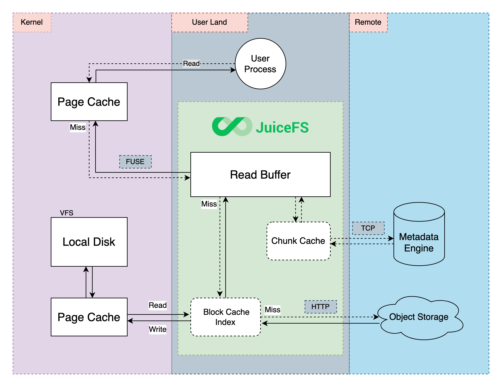

# 缓存

对于一个由对象存储和数据库组合驱动的文件系统，缓存是本地客户端与远端服务之间高效交互的重要纽带。读写的数据可以提前或者异步载入缓存，再由客户端在后台与远端服务交互执行异步上传或预取数据。相比直接与远端服务交互，采用缓存技术可以大大降低存储操作的延时并提高数据吞吐量。

## JuiceFS 的读缓存机制

当访问 JuiceFS 中的文件时，会有多级缓存给经常访问的数据提供更好地性能，读请求会依次尝试内存分页缓存、JuiceFS进程的预读缓冲区、本地磁盘缓存，当缓存中没找到对应数据时才会从对象存储读取，并且会异步写入各级缓存保证下一次访问的性能。



JuiceFS 提供包括元数据缓存、数据读写缓存等多种缓存机制。

## 数据一致性

JuiceFS 提供「关闭再打开（close-to-open）」一致性保证，即当两个及以上客户端同时读写相同的文件时，客户端 A 的修改在客户端 B 不一定能立即看到。但是，一旦这个文件在客户端 A 写入完成并关闭，之后在任何一个客户端重新打开该文件都可以保证能访问到最新写入的数据，不论是否在同一个节点。

「关闭再打开」是 JuiceFS 提供的最低限度一致性保证，在某些情况下可能也不需要重新打开文件才能访问到最新写入的数据。例如多个应用程序使用同一个 JuiceFS 客户端访问相同的文件（文件变更立即可见），或者在不同节点上通过 `tail -f` 命令查看最新数据。

## 元数据缓存

JuiceFS 支持在内核和客户端内存（即 JuiceFS 进程）中缓存元数据以提升元数据的访问性能。

### 内核元数据缓存

内核中可以缓存三种元数据：**属性（attribute)**、**文件项（entry）**和**目录项（direntry）**，可以通过以下[挂载参数](../reference/command_reference.md#juicefs-mount)控制缓存时间：

```
--attr-cache value       属性缓存时长，单位秒 (默认值: 1)
--entry-cache value      文件项缓存时长，单位秒 (默认值: 1)
--dir-entry-cache value  目录项缓存时长，单位秒 (默认值: 1)
```

JuiceFS 默认会在内核中缓存属性、文件项和目录项，缓存时长 1 秒，以提高 lookup 和 getattr 的性能。当多个节点的客户端同时使用同一个文件系统时，内核中缓存的元数据只能通过时间失效。也就是说，极端情况下可能出现节点 A 修改了某个文件的元数据（如 `chown`），通过节点 B 访问未能立即看到更新的情况。当然，等缓存过期后，所有节点最终都能看到 A 所做的修改。

### 客户端内存元数据缓存

:::note 注意
此特性需要使用 0.15.2 及以上版本的 JuiceFS。
:::

JuiceFS 客户端在 `open()` 操作即打开一个文件时，其文件属性（attribute）会被自动缓存在客户端内存中。如果在挂载文件系统时设置了 [`--open-cache`](../reference/command_reference.md#juicefs-mount) 选项且值大于 0，只要缓存尚未超时失效，随后执行的 `getattr()` 和 `open()` 操作会从内存缓存中立即返回结果。

执行 `read()` 操作即读取一个文件时，文件的 chunk 和 slice 信息会被自动缓存在客户端内存。在缓存有效期内，再次读取 chunk 会从内存缓存中立即返回 slice 信息。

:::tip 提示
您可以查阅[「JuiceFS 如何存储文件」](../reference/how_juicefs_store_files.md)了解 chunk 和 slice 是什么。
:::

默认情况下，对于一个元数据已经被缓存在内存的文件，超过 1 小时没有被任何进程访问，其所有元数据缓存会被自动删除。

## 数据缓存

JuiceFS 对数据也提供多种缓存机制来提高性能，包括内核中的页缓存和客户端所在节点的本地缓存。

### 内核数据缓存

:::note 注意
此特性需要使用 0.15.2 及以上版本的 JuiceFS。
:::

对于已经读过的文件，内核会把它的内容自动缓存下来，随后再打开该文件，如果文件没有被更新（即 mtime 没有更新），就可以直接从内核中的缓存读取该文件，从而获得最好的性能。

得益于内核缓存，重复读取 JuiceFS 中相同文件的速度会非常快，延时可低至微秒，吞吐量可以到每秒数 GiB。

JuiceFS 客户端目前还未默认启用内核的写入缓存功能，从 [Linux 内核 3.15](https://github.com/torvalds/linux/commit/4d99ff8f12e) 开始，FUSE 支持[「writeback-cache 模式」](https://www.kernel.org/doc/Documentation/filesystems/fuse-io.txt)，这意味着可以非常快速地完成 `write()` 系统调用。你可以在[挂载文件系统](../reference/command_reference.md#juicefs-mount)时设置 [`-o writeback_cache`](../reference/fuse_mount_options.md#writeback_cache) 选项开启 writeback-cache 模式。当需要频繁写入非常小的数据（如 100 字节左右）时，建议启用此挂载选项。

### 客户端读缓存

JuiceFS 客户端会根据读取模式自动预读数据放入缓存，从而提高顺序读的性能。默认情况下，会在读取数据时并发预读 1 个 block 缓存在本地。本地缓存可以设置在基于机械硬盘、SSD 或内存的任意本地文件系统。

:::tip 提示
您可以查阅[「JuiceFS 如何存储文件」](../reference/how_juicefs_store_files.md)了解 block 是什么。
:::

本地缓存可以在[挂载文件系统](../reference/command_reference.md#juicefs-mount)时通过以下选项调整：

```
--prefetch value          并发预读 N 个块 (默认: 1)
--cache-dir value         本地缓存目录路径；使用冒号隔离多个路径 (默认: "$HOME/.juicefs/cache" 或 "/var/jfsCache")
--cache-size value        缓存对象的总大小；单位为 MiB (默认: 102400)
--free-space-ratio value  最小剩余空间比例 (默认: 0.1)
--cache-partial-only      仅缓存随机小块读 (默认: false)
```

特别地，如果希望将 JuiceFS 的本地缓存存储在内存中有两种方式，一种是将 `--cache-dir` 设置为 `memory`，另一种是将其设置为 `/dev/shm/<cache-dir>`。这两种方式的区别是前者在重新挂载 JuiceFS 文件系统之后缓存数据就清空了，而后者还会保留，性能上两者没有太大差别。

JuiceFS 客户端会尽可能快地把从对象存储下载的数据（包括新上传的小于 1 个 block 大小的数据）写入到缓存目录中，不做压缩和加密。**因为 JuiceFS 会为所有写入对象存储的 block 对象生成唯一的名字，而且所有 block 对象不会被修改，因此当文件内容更新时，不用担心缓存的数据失效问题。**

缓存在使用空间到达上限（即缓存大小大于等于 `--cache-size`）或磁盘将被存满（即磁盘可用空间比例小于 `--free-space-ratio`）时会自动进行清理，目前的规则是根据访问时间，优先清理不频繁访问的文件。

数据缓存可以有效地提高随机读的性能，对于像 Elasticsearch、ClickHouse 等对随机读性能要求更高的应用，建议将缓存路径设置在速度更快的存储介质上并分配更大的缓存空间。

### 客户端写缓存

写入数据时，JuiceFS 客户端会把数据缓存在内存，直到当一个 chunk 被写满或通过 `close()` 或 `fsync()` 强制操作时，数据才会被上传到对象存储。在调用 `fsync()` 或 `close()` 时，客户端会等数据写入对象存储并通知元数据服务后才会返回，从而确保数据完整。

在某些情况下，如果本地存储是可靠的，且本地存储的写入性能明显优于网络写入（如 SSD 盘），可以通过启用异步上传数据的方式提高写入性能，这样一来 `close()` 操作不会等待数据写入到对象存储，而是在数据写入本地缓存目录就返回。

异步上传功能默认关闭，可以通过以下选项启用：

```
--writeback  后台异步上传对象 (默认: false)
```

当需要短时间写入大量小文件时，建议使用 `--writeback` 参数挂载文件系统以提高写入性能，写入完成之后可考虑取消该选项重新挂载以使后续的写入数据获得更高的可靠性。另外，像 MySQL 的增量备份等需要大量随机写操作的场景时也建议启用 `--writeback`。

:::caution 警告
当启用了异步上传，即挂载文件系统时指定了 `--writeback` 时，千万不要删除 `<cache-dir>/<UUID>/rawstaging` 目录中的内容，否则会导致数据丢失。
:::

当缓存磁盘将被写满时，会暂停写入数据，改为直接上传数据到对象存储（即关闭客户端写缓存功能）。

启用异步上传功能时，缓存本身的可靠性与数据写入的可靠性直接相关，对数据可靠性要求高的场景应谨慎使用。

## 常见问题

### 为什么我设置了缓存容量为 50 GiB，但实际占用了 60 GiB 的空间？

对于总量相同的缓存数据，在不同的文件系统上会有不同的容量计算规则。JuiceFS 目前是通过累加所有被缓存对象的大小并附加固定的开销（4KiB）来估算得到的，这与 `du` 命令得到的数值并不完全一致。

为防止缓存盘被写满，当缓存目录所在文件系统空间不足时，客户端会尽量减少缓存用量。
